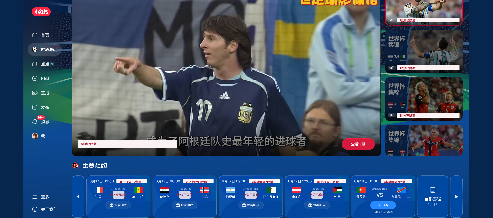

# 小红书世界杯防剧透遮挡工具

一个 Chrome 扩展，用来隐藏小红书世界杯页面里的比分、赛果和进球类剧透文案，同时保留比赛时间、对阵双方、直播/回放画面和入口。

## 为什么做这个项目

世界杯比赛时间对中国观众太不友好了，很多关键比赛都在凌晨。现实一点说，更多时候只能早上起来补集锦或者看回放。

但早上一打开视频页，最容易被页面上的比分、战报标题、推荐卡片直接剧透。比赛结果一旦提前知道了，悬念没了，很多时候就不想看了。

这个扩展就是为了解决这个很具体的痛点：先保护观赛体验，想知道比分的时候再自己点开看。

## 它会隐藏什么

- 比分和完场状态
- 进球、战报、逆转、绝杀、戴帽等标题剧透
- 直播/视频卡片上的剧透字幕
- 推荐卡片里的比分条
- 积分榜、进球时间线、技术统计等容易泄露结果的面板

同时会尽量保留：

- 比赛时间
- 对阵双方
- 队旗和队名
- 直播、集锦、回放画面
- 查看回放/查看详情入口

## 安装

1. 下载或 clone 这个仓库
2. 打开 Chrome 的 `chrome://extensions/`
3. 打开右上角「开发者模式」
4. 点击「加载已解压的扩展程序」
5. 选择这个目录
6. 重新打开或刷新小红书世界杯页面

## 覆盖范围

- 世界杯主页：`https://www.xiaohongshu.com/worldcup26`
- 单场回放页：`https://www.xiaohongshu.com/worldcup26/match/...`

扩展弹窗里可以单独开关「比分/状态」「集锦标题」「剧透面板」。
